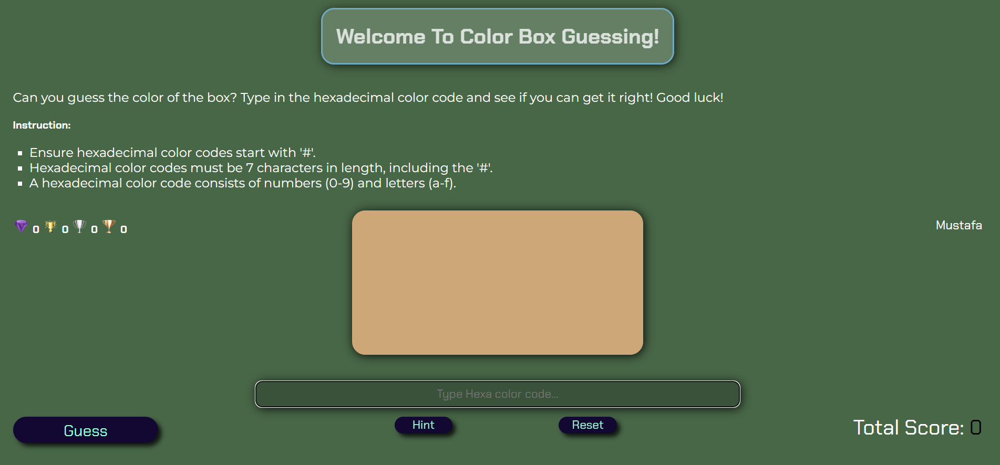
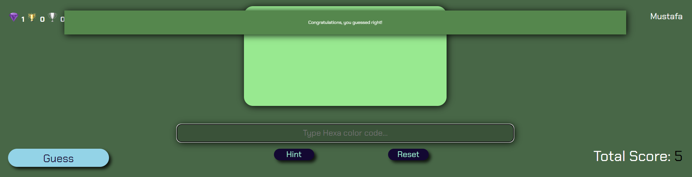
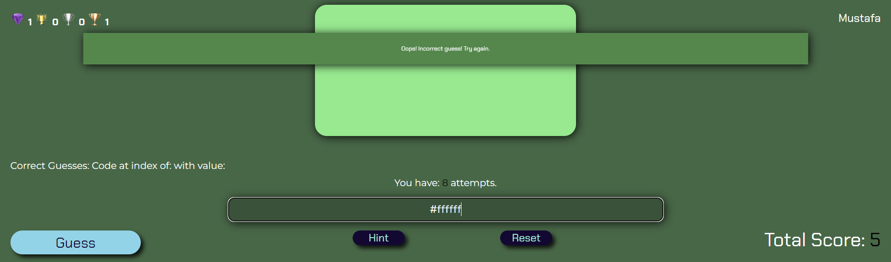
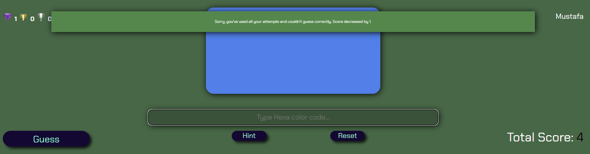
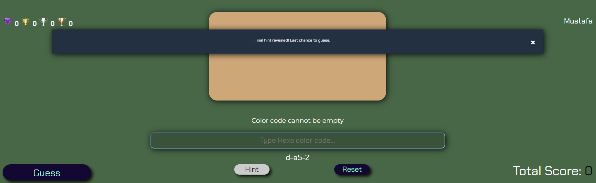

# Color Code Challange
Color Code Challenge is an online platform designed for programmers and designers who work extensively with hex color codes. This platform offers a unique opportunity for users to enhance their understanding of hex color codes through consistent practice. By engaging with various challenges, programmers can strengthen their knowledge and ultimately memorize hex color codes, eliminating the need to search for them every time they're needed. With Color Code Challenge, users can develop a deep understanding of hex color codes and improve their efficiency in programming and design tasks.

[View Color Code Challange live website here](https://ci-mustafa.github.io/Color-Code-Challenge/)

- - - 
## Table Of Content
### [User Experience (UX)](#user-experience-ux-1)
* [User Stories](#user-stories)
### [Design](#design-1)
### [Features](#features-1)
* [Existing Features](#existing-features)
### [Features Left to Implement](#features-left-to-implement-1)
### [Technologies Used](#technologies-used-1)
### [Common Issues and Solutions](#Common-Issues-and-Solutions-1)
### [Testing](#testing-1)
* [Validation Results](#validation-results)
* [Manual Testing](#manual-testing)
* [Lighthouse Report](#lighthouse-report)
### [Deployment and local development](#deployment-and-local-development-1)
* [GitHub Pages](#github-pages)
* [Forking the GitHub Repository](#forking-the-github-repository)
* [Local Clone](#local-clone)
### [Credits](#credits-1)
### [Acknowledgements](#acknowledgements-1)
---
## User Experience (UX)

This project offers a user-friendly experience:
   * Intuitive interface for easy navigation.
   * Clear instructions for challenge.
   * Interactive learning through practice.
   * Progress tracking to monitor achievements.
   * Responsive design for seamless use on all devices.
   * Feedback after each challenge for improvement.
   * Accessibility features for all users.

### User Stories

   * First-time visitor goals
      * Understand how to start guessing hex color codes.
      * Enter a username to begin playing.
      * Learn how to play the guessing game and achieve different levels of difficulty.
   * Returning visitor goals
      * Start playing immediately.
      * View progress and total score.
      * Challenge oneself with more difficult hex color codes.
   * Frequent user goals
      * Compete with other users for the highest score and enhance their hex color code knowledg.
- - -
## Design

   * Color Scheme
      * Primary colors used on the website:
         * #3F6844;
         * #63BCE5;
         * #0F2557;
         * #150734;
         * #7FFFD4;
         * #FFFFFF;
         * #000000;

      

   * Typography
      * Chakra Petch font is employed for headings, buttons and score , while Montserrat serves as the primary font for the website.
      * sans-serif as their fallback font

---
## Features

   * Username Input: Users can enter their username to personalize their experience.
   * Color Code Guessing: Users can guess hex color codes, enhancing their color recognition skills.
   * Score Tracking: Scores are increased based on the accuracy of guesses, with or without hints.
   * Achievements: Users can achieve different milestones and unlock special rewards.
   * Reset Functionality: Users can reset the color and hint process at any time.
   * Responsive Design: The website is designed to be fully responsive, providing an optimal experience on devices of all sizes.

### Existing Features

   * Start Screen 
      * Start screen and username acceptance.
      * Validation rules for username acceptance.
      
   
   * Main Screen
      * Color Code Guessing Instructions: Clear instructions are provided for users to guess hex color codes.
      * Achievements: Users can earn different achievements based on their performance.
      * Automatic Color Generation: A new color is automatically generated when the page loads for the first time, when the reset button is clicked, and when guess attempts reach zero.
      * Username Display: The entered username is displayed on the screen throughout the session.
      * Color Code Guessing Input: An input box is available for users to enter their color code guesses, with validation to ensure correct format.
      * Reset Button: Users have the ability to reset the color and hint process at any time with the reset button.
      * Hint Functionality: Hints are available to assist users in guessing the correct color code.
      * Score Display: The total score is displayed on the screen, updated in real-time based on the user's performance.
      

   * Feedback To User

      * Clear message boxes provide responses to user actions, ensuring they receive immediate and understandable feedback.
      
      
      
      
   
   * Achievement Process and Score Management

      * **No Hints Used**
         * Score Increase: 4 points
         * Achievement: Diamond
         
      * **One Hint Used**: 
         * Score Increase: 3 points
         * Achievement: Gold Cup
         
      * **Two Hints Used**: 
         * Score Increase: 2 points
         * Achievement: Silver Cup
         
      * **Three Hints Used**: 
         * Score Increase: 1 point
         * Achievement: Bronze Cup
         
      * **Incorrect Guess**: 
         * Score Decrease: 1 point when attempts reach zero

